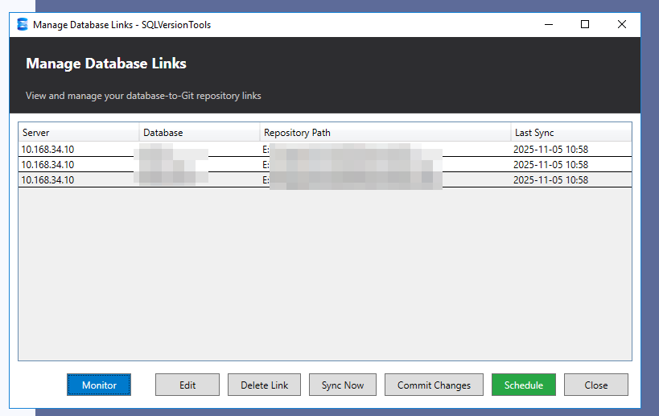
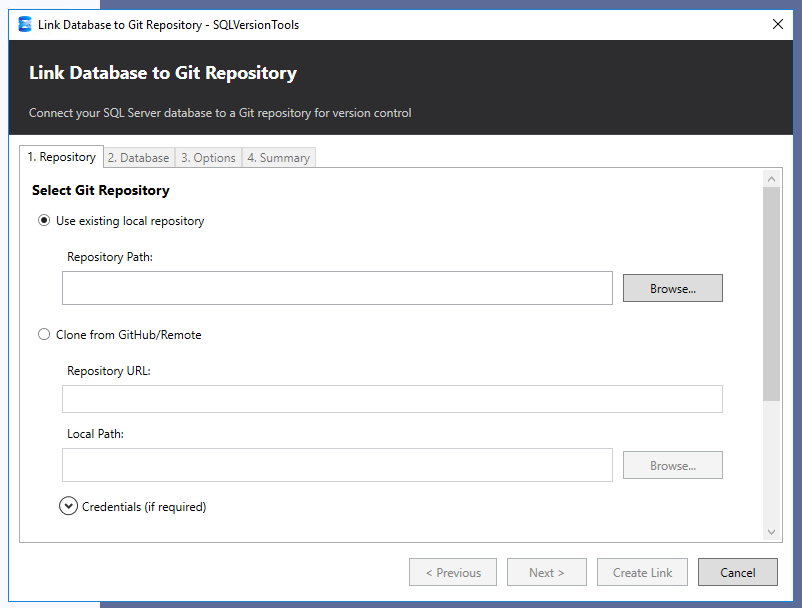

# SQLVersionTools

SQLVersionTools connects SQL Server instances with Git version control, enabling rollback capabilities, history viewing, and many other operations directly from SQL Server Management Studio.

## Overview

  


SQLVersionTools is a comprehensive solution that integrates version control into your SQL Server database development workflow. It consists of two main components:

- **SSMS Extension** - A Visual Studio extension that integrates seamlessly into SQL Server Management Studio 21, providing context menus and dialogs for Git operations
- **Background Service** - A Windows service that handles background operations, synchronization, and scheduling

## Key Features

- **Database-to-Git Linking** - Connect any SQL Server database to a Git repository
- **Automatic Object Tracking** - Track changes to stored procedures, views, functions, and triggers
- **Version History** - View complete history of database object changes
- **Rollback Support** - Revert changes directly from SSMS
- **Object Filtering** - Use .gitignore patterns to exclude specific objects
- **Schema Organization** - Automatically organize database objects into structured folders
- **Commit & Push** - Commit and push changes to remote repositories
- **Real-time Synchronization** - Background service monitors and syncs changes

## System Requirements

- **Operating System**: Windows 10/11 or Windows Server 2016+
- **SQL Server**: SQL Server 2016 or later (all editions)
- **SSMS**: SQL Server Management Studio 21
- **.NET Runtime**: .NET 8.0 Runtime
- **Git**: Git 2.0 or later installed on the system
- **Permissions**: Administrator rights for service installation

## Quick Start

1. Install the SSMS extension by extracting SQLVersionTools.zip to C:\Program Files\Microsoft SQL Server Management Studio 21\Release\Common7\IDE\Extensions
2. Install and start the background service using the installation script
3. In SSMS Object Explorer, right-click on a database
4. Select **SQLVersionTools** > **Link to Git**
5. Configure your Git repository settings
6. Start tracking your database changes!

For detailed installation instructions, see [INSTALLATION.md](INSTALLATION.md)

## Architecture

```
┌─────────────────────────────────┐
│   SQL Server Management Studio  │
│   ┌─────────────────────────┐   │
│   │  SQLVersionTools VSIX   │   │
│   │  (User Interface)       │   │
│   └───────────┬─────────────┘   │
└───────────────┼─────────────────┘
                │
                ├─────────────────────────┐
                │                         │
        ┌───────▼────────┐       ┌────────▼─────────┐
        │  SQL Server    │       │  Git Repository  │
        │  Database      │       │                  │
        └───────┬────────┘       └────────▲─────────┘
                │                         │
                │       ┌─────────────────┘
                │       │
        ┌───────▼───────▼──────┐
        │ SQLVersionTools      │
        │ Background Service   │
        │ (Sync & Monitoring)  │
        └──────────────────────┘
```

## Repository Structure

When you link a database to Git, SQLVersionTools creates the following structure:

  

```
MyDatabaseRepo/
├── .git/
├── .gitignore
├── .sqlversiontools          # Configuration file
├── StoredProcedures/
│   ├── dbo.uspGetUsers.sql
│   ├── dbo.uspCreateOrder.sql
│   └── ...
├── Views/
│   ├── dbo.vwActiveUsers.sql
│   └── ...
├── Functions/
│   ├── dbo.fnCalculateTotal.sql
│   └── ...
└── Triggers/
    ├── dbo.trgAuditLog.sql
    └── ...
```


## Configuration

After linking a database, a `.sqlversiontools` configuration file is created in the repository root:

```json
{
  "version": "1.0",
  "links": [
    {
      "serverName": "localhost\\SQLEXPRESS",
      "databaseName": "MyDatabase",
      "branch": "main",
      "folderStructure": {
        "storedProcedures": "StoredProcedures",
        "views": "Views",
        "functions": "Functions",
        "triggers": "Triggers"
      },
      "filters": {
        "excludeSystemObjects": true,
        "excludeTempTables": true,
        "customIgnorePatterns": ["*_backup", "temp_*"]
      }
    }
  ]
}
```


## Support

For issues, questions, or feature requests, please use the GitHub issue tracker.

## Development Status

- ✅ Phase 1: Git Linking - Complete
- ✅ Phase 2: Commit & Sync - Complete
- ✅ Phase 3: SSMS Extension - Complete
- ✅ Phase 4: Background Service - Complete
- 🚧 Phase 5: Advanced Features - In Progress

## Technology Stack

- **LibGit2Sharp** - Git operations
- **Microsoft.SqlServer.Management.Smo** - SQL Server operations
- **Newtonsoft.Json** - Configuration serialization
- **System.Data.SQLite** - Local state management

## License

See [LICENSE.md](LICENSE.md) for licensing information.

